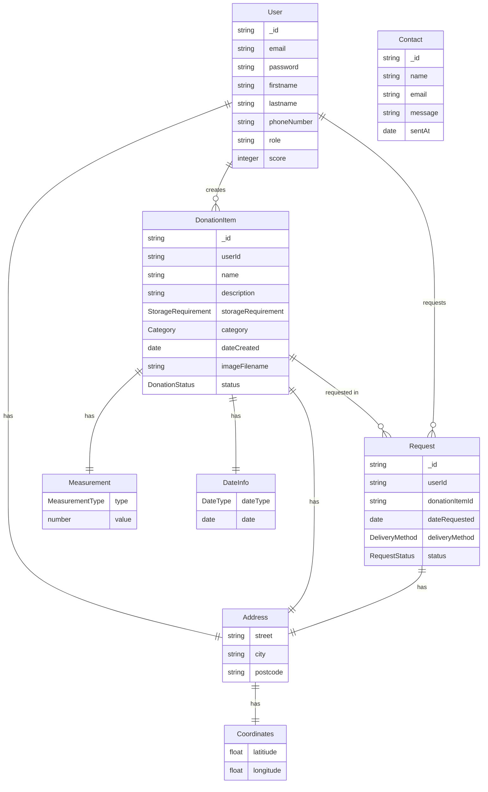

# spn-share-app

> This is an web application developed for the Scottish Pantry Network that allows users to donate food items to pantry. Donators are able to post donations which can be viewed by each pantry and requested if desired. The donator then has the choice of which pantry to deliver to.

## Installation

First, install the programs required to run the application:

- Git
- Node.js

Next, clone the repository and install dependancies:

```
git clone https://github.com/fl3my/spn-share-app.git
```

```
npm install
```

Before seeding the datastore, rename ".env.development" to ".env".
**NOTE: This is not safe for a public git repository as API keys are exposed!**

After, complile the SASS sheet:

```
npm run sass
```

Then seed the datastore:

```
npm run seed
```

Now, start the development enviroment with the following command:

```
npm run dev
```

# Seed Users

**NOTE: All seed users have the same password set up in the ".env" file, called "SEED_USERS_COMMON_PASSWORD"**

- email: admin@example.com
- email: warehouse@example.com
- email: pantry@example.com
- email: donator1@example.com
- email: donator2@example.com

## Client requirements

- Pantries cant control what food items they get from fair share, so foften end up with items they don't want.
- Donators should be able to donate items to a pantry but only if they want it.
- Planning to have a central warehouse in the future.
- Must work with minimum staff.

## Features Implemented

- Donators have the option to deliver their item to a warehouse or directly to pantry that accepts it.
- Pantries can upload excess donation items for other pantries to collect.
- Map so donators can view the location of the pantry that has requested their donation.
- Scoring system and leaderboard for donators to motivate donators to donate.
- Complex search query for donators to find donations.
- Different date types to allow for more precise search for items.
- Added donation item storage properties as some items may need to be frozen or in fridge.
- SCSS to allow the default bootstrap theme colours to be altered easily.

## Screenshots


The image above shows the shopping page that a pantry user would use to request a donation.


The image above shows how a donator would view all the items they have donated.


The image abouve shows how a donator would view all the requests from pantries for an item they have donated.

## Entity relationship diagram



## Testing

To test the application:

```
npm run test
```
