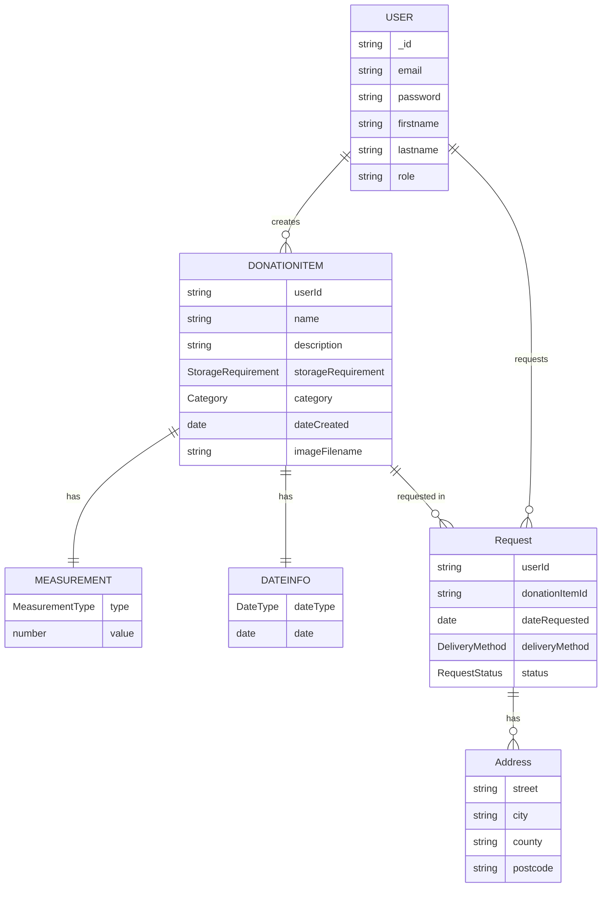

# spn-share-app

Coursework 2 for GCU Web App Development 2.

## Entity relationship diagram

```mermaid
    erDiagram
    USER ||--o{ DONATIONITEM : "creates"
    USER {
        string _id
        string email
        string password
        string firstname
        string lastname
        string role
    }
    DONATIONITEM ||--|| MEASUREMENT : has
    DONATIONITEM ||--|| DATEINFO : has
    DONATIONITEM {
        string userId
        string name
        string description
        StorageRequirement storageRequirement
        Category category
        date dateCreated
        string imageFilename
    }
    MEASUREMENT {
        MeasurementType type
        number value
    }
    DATEINFO {
        DateType dateType
        date date
    }
    USER ||--o{ Request : "requests"
    DONATIONITEM ||--o{ Request : "requested in"
    Request ||--o{ Address : has
    Request {
        string userId
        string donationItemId
        date dateRequested
        DeliveryMethod deliveryMethod
        RequestStatus status
    }
    Address {
        string street
        string city
        string county
        string postcode
    }
```
